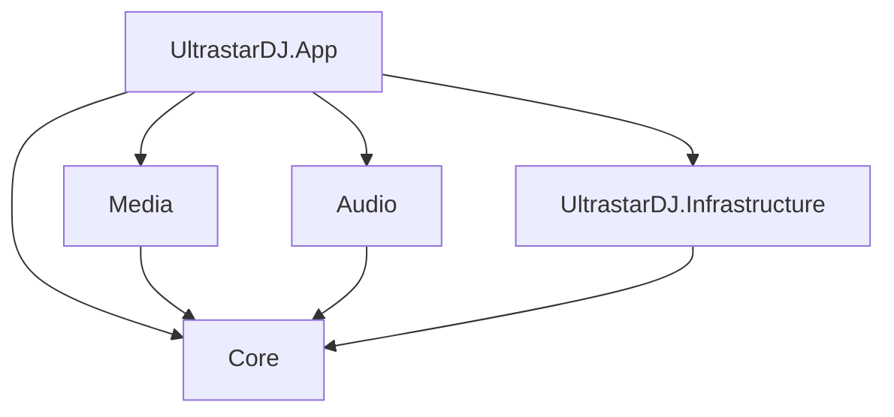
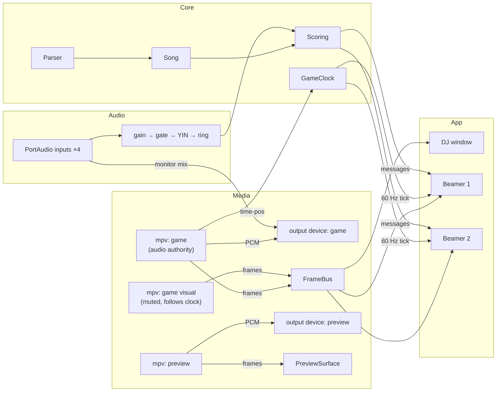

# 01 — Architecture

## Stack

| Layer | Technology | Why |
|---|---|---|
| Language / runtime | **C# on .NET 10** | Strong AI-agent support, GC (no memory bugs), self-contained builds for macOS + Windows |
| UI | **Avalonia 12** + XAML, **CommunityToolkit.Mvvm** | Cross-platform, HTML-like declarative markup, real multi-window, Skia rendering for 60 fps game overlays |
| Media decode + playback | **libmpv** via thin P/Invoke | Plays local files *and* YouTube (built-in yt-dlp hook, DASH audio+video sync), `--audio-device` per instance, render API hands us frames |
| Audio I/O | **PortAudio** (`PortAudioSharp2`) | Mic capture per device/channel, multichannel outputs, monitoring mix — replaces cpal |
| Pitch detection | own C# port of YIN (from `pitchy`) | ~150 lines, deterministic, testable |
| Persistence | **SQLite** (`Microsoft.Data.Sqlite` + Dapper) for library/catalog; JSON files for settings | 27k-song catalog needs a real DB; settings stay human-readable |
| Guest songbook | **ASP.NET Core Kestrel** minimal API, hosted in-process | Same language as everything else; replaces axum |
| Logging | `Microsoft.Extensions.Logging` + Serilog (file sink) | Agents and users can attach logs to bug reports |
| Tests | xUnit | Core and game logic are pure and fully testable |
| Packaging | `dotnet publish` self-contained + scripts (`.app`/dmg on mac, Velopack on win) | See `06-build-release.md` |

**Hard rule: no WebView anywhere.** If a design proposes embedding a browser for YouTube or anything else, it re-creates the problem this rewrite exists to fix.

---

## Solution layout

```
Ultrastar-DJ/
  UltrastarDJ.slnx
  global.json                       ← pins .NET SDK version
  Directory.Build.props             ← shared compiler settings (nullable, warnings) + <Version>
  Directory.Packages.props          ← central NuGet package versions
  .editorconfig
  src/
    UltrastarDJ.Core/               ← domain. Song, Note, parser, timing, scoring, queue. NO dependencies.
    UltrastarDJ.Media/              ← libmpv wrapper, MediaChannel (game/preview), FrameBus, sync
    UltrastarDJ.Audio/              ← PortAudio devices, mic pipelines, YIN, monitoring mixer, latency test
    UltrastarDJ.Infrastructure/     ← SQLite repos, settings store, USDB client, songbook server, sidecar locator
    UltrastarDJ.App/                ← Avalonia: windows, views, view models, composition root (DI)
  tests/
    UltrastarDJ.Core.Tests/
    UltrastarDJ.Media.Tests/        ← sync/clock logic (mpv itself is mocked)
    UltrastarDJ.Audio.Tests/        ← YIN, gate, ring buffer, scoring integration
  natives/                          ← downloaded per machine by scripts/fetch-natives.*  (git-ignored)
  scripts/                          ← fetch-natives, publish, bundle-macos
  docs/
```

### Dependency rule



Arrows point **inward only**. `Core` references nothing. `Media`, `Audio`, `Infrastructure` never
reference each other or `App`. Only `App` wires them together (composition root). Enforce this with
project references — a project must not add a reference that creates an arrow in the other direction.

---

## Runtime picture



Key consequences:
- **One decode, N windows.** Beamers render the same frame buffer; nothing is streamed twice.
- **The DJ's game audio is the clock.** Everything else (visual player, lyrics, note lanes, scoring) follows `GameClock`.
- **Cross-window "IPC" is just in-process messaging** (`WeakReferenceMessenger`), replacing the prototype's Tauri event contract.

---

## Layer responsibilities

### `UltrastarDJ.Core`
- `Song`, `NoteTrack`, `LyricLine`, `Note`, `NoteType` (records).
- `UltraStarParser` — header + notes, tolerant of `,` decimals, `#MP3`/`#AUDIO`, `#VIDEO`/`#YOUTUBE`, negative beats, `#RELATIVE` (detect, warn).
- `BeatMath` — beats ↔ seconds, quadrupled BPM, `GAP`, mic-delay-to-beats.
- `SongValidator` — pure rules; file existence is injected via `IFileExistence`.
- `ScoreEngine` — beat matching, points, phrase bonus, per-player state.
- `SongQueue`.
- `GameClock` abstraction (`IGameClock`: `Position`, `IsRunning`) — implemented in `Media`.
- **No** I/O, **no** threading primitives beyond immutability, **no** framework types.

### `UltrastarDJ.Media`
- `MpvPlayer` — safe wrapper over libmpv (`IMediaPlayer`).
- `MediaChannel` (`Game`, `Preview`) — owns players, output device, gain, metering.
- `MediaSourceResolver` — turns a `Song` into a `MediaPlan` (which player plays what, which mode of `#VIDEOGAP`).
- `FrameBus` — publishes decoded frames to any number of render surfaces.
- `ClockFollower` — keeps the visual player aligned with the audio authority.
- `MediaGameClock : IGameClock`.
Details: `02-media-engine.md`.

### `UltrastarDJ.Audio`
- `IAudioBackend` (PortAudio impl): enumerate inputs/outputs, open input by device+channel, open output by device+channel offset.
- `MicPipeline` per player: gain → gate → level → YIN → `PitchRingBuffer` → `PitchSample`.
- `MonitorMixer`: sums player mics × mixGain (mute aware) into the game output device.
- `LatencyTest`: beep → echo → round-trip ms.
Details: `03-game-engine.md`.

### `UltrastarDJ.Infrastructure`
- `SqliteSongRepository`, `SqliteUsdbCatalog`, `JsonSettingsStore`.
- `UsdbClient` (login, catalog paging with progress, song txt).
- `SongbookServer` (Kestrel) + static mobile page.
- `SidecarLocator` (finds `yt-dlp`, `ffmpeg` in `natives/` or app bundle).
- `LocalFolderScanner`, `SourceAvailabilityWatcher`.

### `UltrastarDJ.App`
- Composition root (`Program.cs` / `App.axaml.cs`): DI container, logging, settings load.
- Windows: `DjWindow`, `BeamerWindow` (instantiated per display).
- ViewModels (MVVM), views (XAML), custom controls (`NoteLaneControl`, `LyricsControl`, `VideoSurface`).
- Design tokens as resource dictionaries (`Styles/Tokens.axaml`).
Details: `04-ui.md`.

---

## Cross-cutting rules

1. **Interfaces at layer boundaries only.** `IMediaPlayer`, `IAudioBackend`, `ISongRepository`, `IUsdbClient`, `IGameClock`, `IFileExistence`. Do not create an interface for a class that has one implementation and is never faked.
2. **Constructor injection** via `Microsoft.Extensions.DependencyInjection`. No service locator, no static singletons for stateful services. Factories (`IMediaPlayerFactory`) only where instances are created at runtime with parameters.
3. **Realtime code is not MVVM.** Audio callbacks, frame delivery and the game tick run on non-UI threads, allocate nothing per call, and hand results to the UI via the messenger or `Dispatcher.UIThread.Post`. Never touch Avalonia objects from those threads.
4. **Units are explicit.** `TimeSpan` where possible; otherwise suffix (`gapMs`, `videoGapSec`, `lengthBeats`). The prototype had multiple ms/s and beat/quarter-beat bugs — see `05-conventions.md`.
5. **Everything in `Core` and the scoring/pitch pipeline has tests.** Port the prototype's known edge cases (negative beats, pre-GAP notes, quadrupled BPM, word spacing).
6. **Log, don't `Console.WriteLine`.** Structured logging with category per class; verbose logs guarded by level.

---

## State ownership

| State | Owner | Notes |
|---|---|---|
| Library, catalog | `Infrastructure` repos | queried by `LibraryViewModel` |
| Selected preview song | `PreviewViewModel` | |
| Queue | `Core.SongQueue` (singleton service) | |
| Playback status (idle/loaded/preview/countdown/playing/paused) | `PlaybackService` in `App` (thin orchestrator over `Media` + `Audio`) | single source of truth; beamers observe it |
| Players config, displays config, outputs config, settings | `JsonSettingsStore`-backed services | |
| Live game state (positions, sung beats, scores) | `GameSession` (per song, created by `PlaybackService`) | beamers subscribe to its messages |

No window holds authoritative state. Beamer windows are **pure views** of `PlaybackService` + `GameSession`.
