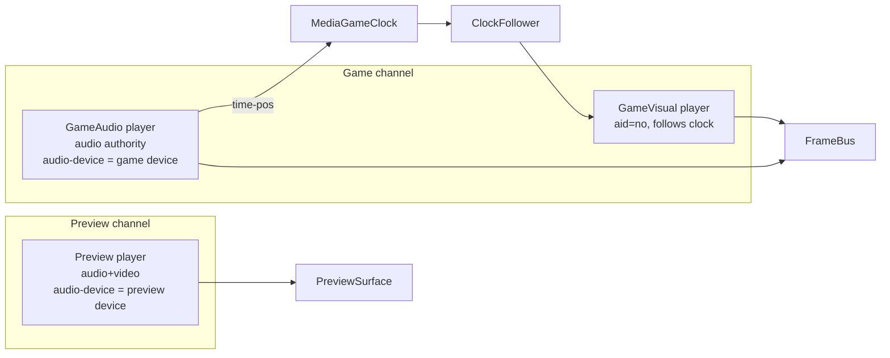

# 02 — Media Engine

The media engine is the reason v2 exists. Read this before touching anything under `UltrastarDJ.Media`.

## Goals

1. Play every media case in `00-vision.md` from one code path.
2. **YouTube is fetched and decoded once per role**, never once per window.
3. Every player has its own **output device** (and channel pair) — including YouTube preview.
4. Video frames are available to **any number of windows** in-process.
5. One **authoritative clock** for the game; everything else follows it.

---

## Building block: `MpvPlayer`

A thin, safe wrapper over libmpv (`mpv_create`, `mpv_set_option`, `mpv_command`, `mpv_observe_property`,
`mpv_render_context_*`). One `MpvPlayer` = one `mpv_handle` = one media pipeline.

```csharp
public interface IMediaPlayer : IAsyncDisposable
{
    Task LoadAsync(MediaSource source, MediaLoadOptions options, CancellationToken ct);
    void Play();
    void Pause();
    void Stop();
    void Seek(TimeSpan position);
    TimeSpan Position { get; }        // read from "time-pos" (observed property, cached)
    TimeSpan? Duration { get; }
    double Volume { get; set; }       // 0..1 → mpv "volume" 0..100
    bool Muted { get; set; }
    string? AudioDevice { get; set; } // mpv "audio-device" id, null = auto
    MediaState State { get; }         // Idle, Loading, Buffering, Ready, Playing, Paused, Ended, Error
    double LevelRms { get; }          // 0..1 from astats filter, see Metering
    event Action<MediaState> StateChanged;
    event Action<string> ErrorOccurred;
    IFrameSource? Frames { get; }     // null when video disabled
}
```

`MediaSource` is a discriminated record: `LocalFile(path)`, `YouTube(videoId)`.
`MediaLoadOptions`: `Audio` (bool), `Video` (bool), `StartAt` (TimeSpan), `EndAt` (TimeSpan?), `MaxHeight` (int, default 720), `ExternalVideo` (MediaSource?).

### mpv options used (per instance)

| Purpose | Option / command |
|---|---|
| Output device | `audio-device=<id>`; device list from `audio-device-list` property |
| Video off (audio-only role) | `vid=no` |
| Audio off (visual-only role) | `aid=no` (no audio stream is downloaded for YouTube either) |
| YouTube | `ytdl=yes`, `script-opts=ytdl_hook-ytdl_path=<sidecar yt-dlp>`, `ytdl-format=bestvideo[height<=720]+bestaudio/best[height<=720]` (or `bestaudio` when `Video=false`) |
| Hardware decode | `hwdec=auto-safe` |
| Range | `start=<sec>`, `end=<sec>` |
| External video for Case 2/3 | after load: `video-add <file-or-ytdl://ID>` then `vid=1`; plus `audio-delay` for `#VIDEOGAP` (see below) |
| Frame delivery | `mpv_render_context` with `MPV_RENDER_API_TYPE_SW` (software) rendering into our buffer |
| Buffering state | observe `paused-for-cache`, `demuxer-cache-duration`, `core-idle`, `eof-reached` |
| Metering | `af=@meter:lavfi=[astats=metadata=1:reset=1:measure_overall=none:measure_perchannel=RMS_level]`; read `af-metadata/meter` → `lavfi.astats.1.RMS_level` (dBFS) at ~20 Hz |
| Channel pair on multichannel device | `audio-channels=<n>` + `af=@route:lavfi=[pan=<n>c|c<k>=c0|c<k+1>=c1]` where *k* = channel offset |

Everything mpv-specific stays inside `MpvPlayer`. Nothing else in the solution knows mpv option names.

### Threading

libmpv delivers events on its own thread (`mpv_set_wakeup_callback`) and render updates on another.
`MpvPlayer` drains events on a dedicated task, updates cached properties with `Volatile`/`Interlocked`,
and raises .NET events **on a thread pool thread**. Callers marshal to the UI themselves. No mpv call
is made from a render/frame callback.

---

## Roles and channels



| Role | Audio | Video | Device |
|---|---|---|---|
| **GameAudio** | yes | only when the same file/stream is also the visual (Cases 4, 6) | game |
| **GameVisual** | no | yes | — |
| **Preview** | yes | yes (small) | preview |

`MediaChannel` (`Game`, `Preview`) owns: its player(s), `OutputDevice` (device id + channel offset), `Gain`,
`Level`. Device/gain are persisted per channel. A channel is a long-lived service; players inside it
are re-created per song (a fresh `mpv_handle` per song is cheaper than fighting stale state).

---

## `MediaPlan` — mapping the six cases

`MediaSourceResolver.Resolve(Song) → MediaPlan` decides what each role plays. Pure function, unit-tested.

| Case | GameAudio source | GameAudio video? | GameVisual source | `#VIDEOGAP` mode |
|---|---|---|---|---|
| 1 MP3 + image | mp3 | no | — (image via UI) | — |
| 2 MP3 + local video | mp3 | no | local video, `aid=no` | A |
| 3 MP3 + YouTube | mp3 | no | `ytdl://ID`, `aid=no`, video-only format | A |
| 4 YouTube only | `ytdl://ID` (audio+video) | **yes** — same instance is the visual | — | B |
| 5 MP3 + cover | mp3 | no | — | — |
| 6 local video only | local video (audio+video) | **yes** | — | B |

Case 3 downloads **one video-only stream** (no audio track). Case 4 downloads **one audio+video stream**.
Compared to the prototype (3–4 full streams) this is the minimum possible.

### `#VIDEOGAP`

- **Mode A** (separate audio file): the visual must be at `T + videoGap` when game time is `T`.
  `ClockFollower` targets `clock.Position + videoGap`.
- **Mode B** (video *is* the audio): both start at `videoGap` inside the file; game time
  `T = player.Position − videoGap`. `MediaGameClock` subtracts it; `LoadAsync` uses `StartAt = videoGap`.

The clock always starts at **0 = game time 0**, so `#GAP`, lyrics and note timing never know about `#VIDEOGAP`.

### `#START` / `#END`

Applied to the GameAudio player (`start`, `end` options). `MediaGameClock` exposes `Position` relative to
`#START` so notes stay aligned to the file's own timeline — **check the UltraStar spec**: note beats are
relative to the file start, not to `#START`; the clock therefore reports *file position − videoGap* and
the UI simply begins at `#START`. Song end is detected by `eof-reached` or `Position ≥ End`.

---

## Clock and sync

```csharp
public interface IGameClock
{
    /// Seconds of game time (0 = audio start after #VIDEOGAP handling). Monotonic while playing.
    double PositionSec { get; }
    bool IsRunning { get; }
}
```

`MediaGameClock` reads `time-pos` from GameAudio (observed, ~updates every video frame or 50 ms) and
**interpolates** between updates with a `Stopwatch`, clamped so it can never run ahead by more than one
update interval. This is the prototype's `smoothTime` idea, now in-process and with real time-pos updates
instead of 16 ms IPC ticks.

`GameTicker` runs a 60 Hz loop (dedicated thread + `PeriodicTimer`) that publishes `GameTick(positionSec, beat)`
via the messenger. Beamer controls invalidate on the tick; scoring reads mic pipelines on the tick.

`ClockFollower` (GameVisual only), 20 Hz:
- `drift = visual.Position − (clock.Position + videoGap)`
- `|drift| > 0.35 s` → hard `Seek`
- `0.05 s < |drift| ≤ 0.35 s` → nudge `speed` to 0.98 / 1.02 until inside 0.02 s, then back to 1.0
- paused ↔ playing mirrored from the audio player.

---

## `FrameBus`

```csharp
public interface IFrameSource
{
    /// Latest decoded frame. BGRA32, top-down. Buffer is owned by the source; copy inside the callback.
    event Action<FrameRef> FrameReady;
    (int Width, int Height) Size { get; }
}
```

- `MpvPlayer` renders with the software render API into a **double buffer** sized to the video (capped at
  720p by `ytdl-format` and `--vf=scale` for local files above 1080p).
- `FrameBus` fan-outs `FrameReady` to subscribed **surfaces**. Each `VideoSurface` control owns a
  `WriteableBitmap`, copies the frame into it on the render thread, and calls `InvalidateVisual()` via the
  dispatcher. Copy cost at 720p BGRA ≈ 3.7 MB/frame — fine for 3 surfaces at 30 fps.
- Future optimisation (not now): OpenGL render API + shared texture. Keep `IFrameSource` stable so this is a
  drop-in.

The DJ window may show a small monitor of the game visual using the same bus. The preview player has its own
`IFrameSource` shown only in the preview widget.

---

## Readiness / buffering (replaces `canplaythrough`)

`PlaybackService` may enable **Play** only when:
- GameAudio `State == Ready` (file loaded, `demuxer-cache-duration ≥ 3 s` or EOF cached, not `paused-for-cache`),
- GameVisual (if any) `State == Ready`,
- every open beamer has reported `BeamerReady` (window laid out, surfaces subscribed).

This gives YouTube a real readiness signal — the prototype had none.

---

## Device routing

- Device list: union of mpv `audio-device-list` (for output names/ids mpv understands) and PortAudio outputs
  (for channel counts). Matched by name; expose `OutputDeviceInfo { Id, Name, MaxChannels }`.
- Multichannel devices are offered as pairs ("Device — Ch 1–2", "Ch 3–4", …). Selection stores `(deviceId, channelOffset)`.
- Hidden device name patterns: `blackhole`, `loopback`, `speaker audio recorder`, `screen recorder`.
- Hot-plug: poll `audio-device-list` every 3 s while a routing view is open; if the selected device vanishes → reset to default and notify.
- Mic monitoring uses a **separate PortAudio output stream** on the game device (see `03-game-engine.md`). Two streams on one device are mixed by the OS; that is acceptable and much simpler than routing mpv PCM through our own mixer.

### Known fallback
If `pan`-based channel-pair routing or `astats` metering proves unreliable on a platform, the fallback is to
decode audio ourselves (FFmpeg.AutoGen) into a `PortAudio` output stream and keep mpv for video only.
Do **not** start there — measure first.

---

## Preview channel specifics

- One `MpvPlayer` with audio + video, `audio-device` = preview device, small surface in the DJ window.
- For YouTube: `ytdl-format=best[height<=360]` — preview quality is irrelevant, bandwidth matters.
- Loading a song into the game while it is previewing: preview keeps playing (DJ may cue). Starting the game
  **does not** stop preview automatically; the DJ decides. (Prototype behaviour; revisit if annoying.)

---

## Failure handling

| Failure | Behaviour |
|---|---|
| yt-dlp missing / outdated | `SidecarLocator` verifies presence at start; offer "update yt-dlp" action (downloads latest release) |
| YouTube video unavailable / geo-blocked | `ErrorOccurred` → `PlaybackService` stops, DJ sees dialog with mpv's message |
| Output device disappears during song | mpv falls back to default automatically; we show a toast and reset the stored device |
| Local file unsupported | libmpv/FFmpeg decode nearly everything; if it fails the validator error dialog shows the mpv error |

---

## Acceptance test for the media spike (Sprint 1)

1. Play a YouTube ID in the game channel: audio on **device B**, video visible in DJ monitor **and two** beamer windows simultaneously, single download (verify with yt-dlp/mpv logs: one format request).
2. Simultaneously play a local mp3 in the preview channel on **device A** (headphones).
3. Case 3: mp3 + YouTube visual stays within 50 ms after 3 minutes (log drift).
4. Pause/resume/seek keep both roles aligned.
5. Switch the game device mid-song → audio moves, video continues.
6. Meter values move with the music on both channels.
7. Case 6 with `#VIDEOGAP:19.5` → game clock reads 0.0 when the file is at 19.5 s.
