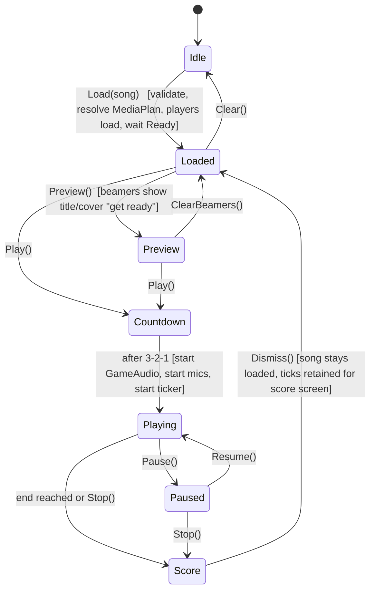

# 03 — Game Engine: timing, microphones, pitch, scoring, rendering data

All of this was implemented and tuned in the prototype. Formulas and thresholds below are the
tested values — keep them unless a test proves otherwise.

---

## UltraStar timing essentials

| Tag | Unit | Meaning |
|---|---|---|
| `#BPM` | quarter-beats/min ×¼ | **Real beats per minute = BPM × 4.** `#BPM:120` → 480 beats/min |
| `#GAP` | **ms** | Audio time of beat 0 |
| `#VIDEOGAP` | **seconds** | See `02-media-engine.md` |
| `#START` / `#END` | seconds / ms (check parser) | Playback range |
| note `pitch` | semitones relative to C4 (=0) | 12 per octave; may be negative |
| note `startBeat`, `lengthBeats` | beats | may be **negative** (pre-GAP notes) — never clamp |

```csharp
static double BeatLengthSec(double bpm) => 60.0 / (bpm * 4);
static double BeatAt(double gameTimeSec, Song s) => (gameTimeSec - s.GapMs / 1000.0) / BeatLengthSec(s.Bpm);
static double MsToBeats(double bpm, double ms) => (ms / 1000.0) * (bpm / 60.0) * 4;
```

Note types: `:` normal, `*` golden, `F` freestyle, `R` rap, `G` rap-golden. `-` ends a phrase (line break),
`P1`/`P2` switch voice (duet → separate `NoteTrack`). `#RELATIVE:yes` is legacy — detect and warn, don't crash.
Syllable spacing: trailing/leading spaces in the note text are word boundaries — the parser **must not trim** them.

---

## Playback state machine



Owner: `PlaybackService` (App). Rules from the prototype:
- `Load` allowed only in `Idle`/`Loaded`/`Preview`.
- `Play` allowed only when a beamer is open **and** media is `Ready` **and** every open beamer reported `BeamerReady`.
- Audio-config views are locked while `Playing`/`Paused`.
- The countdown runs **on the beamer clock**: `BeamerWindow` shows 3-2-1 and reports `CountdownDone`; the first report starts the media (dedupe when two beamers report). This is what makes the visual countdown and audio start coincide.
- `Stop` keeps the song loaded (`Loaded`), it does not clear it.

---

## Microphone pipeline (per player)

```
PortAudio input (device, channel L/R/mono)
  → inputGain (0–2)                      ← boosts quiet mics; applied first
  → noise gate (threshold 0–0.5, peak)   ← below → silence: no pitch, no monitor output
  → level meter (RMS, 20 Hz to UI)
  → hop buffer 2048 samples @ device rate (≈46 ms @ 44.1 kHz), hop 256
  → YIN → (frequencyHz, clarity)          ← reject clarity < 0.9 or hz outside 60–1200
  → midi = 69 + 12·log2(hz/440)  (float; UltraStar pitch = midi − 60)
  → PitchRingBuffer(5) median             ← rejects one-frame spikes; cleared on start/resume
  → PitchSample { PlayerId, MidiNote (−1 = silence), Level }
```

- One `MicPipeline` per **active** player = has a mic assigned, not disconnected, assigned to an **open** display.
- Runs entirely on the PortAudio callback thread + one worker; **no allocations** in the callback (preallocated buffers, `ArrayPool` never used there).
- `PortAudio` stream per **device**, demuxed to players by channel — two players on L/R of the same interface share one stream.
- Hot-plug: device list polled every 3 s; disappearance → `MicDisconnected(playerId)` message, pipeline stopped, UI toast; reappearance → `MicReconnected`, auto-restart if still assigned.

### Monitoring mix

`MonitorMixer` opens one PortAudio **output** stream on the game output device (respecting channel offset)
and sums each active player's gated mic × `mixGain` (0–2, muted → 0, fader position kept). Starts when the
song starts, stops on `Score`/`Stop`. Optionally available in mic-test mode.

### Mic delay

`micDelayMs` per player (default 40, UI cap 250, storage cap 500) is the input latency. It is **not** applied as
an audio delay; it shifts the **beat used for comparison**:

```csharp
double delayedBeat = currentBeat - MsToBeats(song.Bpm, player.MicDelayMs);
Note? target = FindNoteAtBeat(track, delayedBeat);
```

Visual consequence: the sung fill lags the playhead by `micDelayMs` — this is correct and expected.

### Latency calibration (`LatencyTest`)

Play a short beep on the game output, record from the player's mic, detect onset → round-trip ms. 5 trials,
median, show result, "apply to player". Reference measurements from the prototype: USB mic ≈ 99 ms, second
mic ≈ 119 ms (these include output latency; we accept round-trip as the practical value).

---

## Scoring (`Core.ScoreEngine`)

Runs on the 60 Hz `GameTick` (throttle beat evaluation to **once per beat**, not per tick — at 480 beats/min
a beat is 125 ms; ticks between beats re-use the last result).

**Octave-invariant match**

```csharp
static bool Matches(double sungMidi, int targetUsPitch, double tolerance)
{
    double sungUs = sungMidi - 60;                       // UltraStar pitch space
    double diff = Math.Abs(sungUs - targetUsPitch) % 12;
    double distance = diff > 6 ? 12 - diff : diff;       // fold to [0, 6]
    return distance <= tolerance;
}
```

| Difficulty | tolerance (semitones) |
|---|---|
| Easy | 2 |
| Medium | 1 |
| Hard | 0.5 |

**Per beat**

| Note type | Correct when | Points |
|---|---|---|
| normal | match | 1 × pointsPerBeat |
| golden | match | 2 × pointsPerBeat |
| rap / rap-golden | any sound above gate | 1× / 2× |
| freestyle | always "correct", no points | 0 |

`pointsPerBeat = 10_000 / totalScorableBeats` (golden counted ×2 in the denominator so the max is exactly 10 000).
Phrase bonus (all beats of a phrase correct): +1 000 → clamp final to 10 000. *(Confirm against USDX if we
want parity; the prototype used a simpler variant.)*

**Per-note state** (used by the beamer): `correctBeats`, `isFullyCorrect = correctBeats * 2 >= lengthBeats`
(50 % threshold — accounts for beat skipping at high BPM), `firstSungRow` for the wrong-fill row.

**Output**: `ScoreEngine` publishes `PitchTick` messages ~20 Hz:

```csharp
record PitchTick(int PlayerId, double Beat, double MidiNote, bool Correct, bool IsFirstInNote,
                 NoteType NoteType, int RowPitch, int Score, int MaxScore);
```

Beamers keep their own incremental note-fill state from these ticks (no history replay).

---

## Beamer rendering data model

Each `BeamerWindow` shows, for **its assigned players only**, one `NoteLane` each (stacked), plus one shared
lyrics bar and a progress bar. Everything is driven by `GameTick` + `PitchTick` — the beamer never asks the
engine for state.

### Active phrase

```
activeLine = the LyricLine whose [firstNote.startBeat, lastNote.end] contains currentBeat,
             else the next upcoming line.            (use firstNote.startBeat, not line.startBeat)
activeLine is extended by min(micDelayBeats, gapToNextPhrase/2) so late mic data still lands in it.
```

### Note lane geometry (per phrase, recomputed only on phrase change)

```
rowCount     = players on this beamer ≤ 2 ? 16 : 12
phraseStart  = notes[0].startBeat ; phraseBeats = lastNote.end − phraseStart
x (0..1)     = (note.startBeat − phraseStart) / phraseBeats
w (0..1)     = note.lengthBeats / phraseBeats
row          = PitchToRow(note.pitch, avgPhrasePitch, rowCount)   // octave-wrapped
y (0..1)     = (row − 1) / rowCount ; h = 1 / rowCount
```

```csharp
static int PitchToRow(int pitch, double avg, int rowCount)
{
    int p = pitch;
    int min = (int)Math.Floor(avg - rowCount / 2.0);
    int max = min + rowCount - 1;
    while (p > max) p -= 12;
    while (p < min) p += 12;
    double offset = p - avg;
    return Math.Abs((int)Math.Ceiling(rowCount / 2.0 + offset) - rowCount) - 1;
}
```

Styles: normal = white/black bar (setting), golden = gold with pulsing glow, rap = dashed border,
freestyle = dotted border; syllable text centred inside when `lengthBeats ≥ 2`. Bars have min height
(readability floor) and rounded corners (8 px for ≤ 2 players, 4 px for 3–4).

### Sung fill

- Per note: fill grows **beat by beat** from the note's left edge as `PitchTick`s arrive (bridge gaps ≤ 2
  beats caused by tick skipping).
- Correct → drawn **inside the note bar** in player colour.
- Wrong → drawn at the **sung row** (fixed at the first wrong beat of the segment — no vibrato jitter), dimmed.
- Fully-correct note → glow; all notes of the phrase correct → "PERFECT" flash (also checked at phrase switch).

### Playhead

Vertical line at `x = (positionSec − phraseStartSec) / phraseDurSec` — recomputed every tick from the clock,
not animated independently. (The prototype used a CSS animation to escape JS jank; with Skia + our own
60 Hz tick a direct draw is simpler and correct.)

### Lyrics bar

Current phrase large, next phrase smaller/dimmed; per-syllable **sweep** = horizontal gradient at
`(currentBeat − note.startBeat) / note.lengthBeats`; 3-second **lead-in bar** shrinking right→left before a
phrase starts after a gap; `white-space: pre` semantics (syllable spaces preserved).

### Screens

`Idle` (logo), `Preview` (cover, artist, title, assigned player badges), `Countdown` (3-2-1 over the
background), `Playing`/`Paused`, `Score` (all players, sorted by id, animated count-up 1.8 s ease-out,
winner highlighted).

---

## Rendering implementation guidance (see `04-ui.md`)

- One custom `GameOverlayControl : Control` per beamer draws lanes, fills, playhead, lyrics with
  `DrawingContext` on each `GameTick` (`InvalidateVisual` from the UI thread). Static geometry per phrase is
  cached; per-tick work is only the fill and playhead. No per-tick allocations of brushes/pens — cache them.
- The video `VideoSurface` sits underneath; the overlay is transparent.
- Target: 60 fps on a 1080p beamer with 2 lanes on a 2020-class laptop.

---

## Test cases to port (Core.Tests / Audio.Tests)

- Parser: `,` decimals; `#MP3` vs `#AUDIO`; `#VIDEO` URL → youtubeId; negative beats; pre-GAP notes; duet `P1/P2`; `#RELATIVE` warning; syllable spacing preserved.
- BeatMath: quadrupled BPM; `MsToBeats(120, 125) == 1`.
- Matching: octave folding (sung 72 vs target 0 → match), tolerance per difficulty, rap = any sound.
- Score: max exactly 10 000 for a perfect run incl. golden; freestyle contributes 0.
- PitchToRow: wrap cases from the prototype.
- RingBuffer: median rejects single spike; cleared on start.
- Determinism: identical `PitchSample` sequence → identical score (see `05-conventions.md`, non-determinism lesson).
