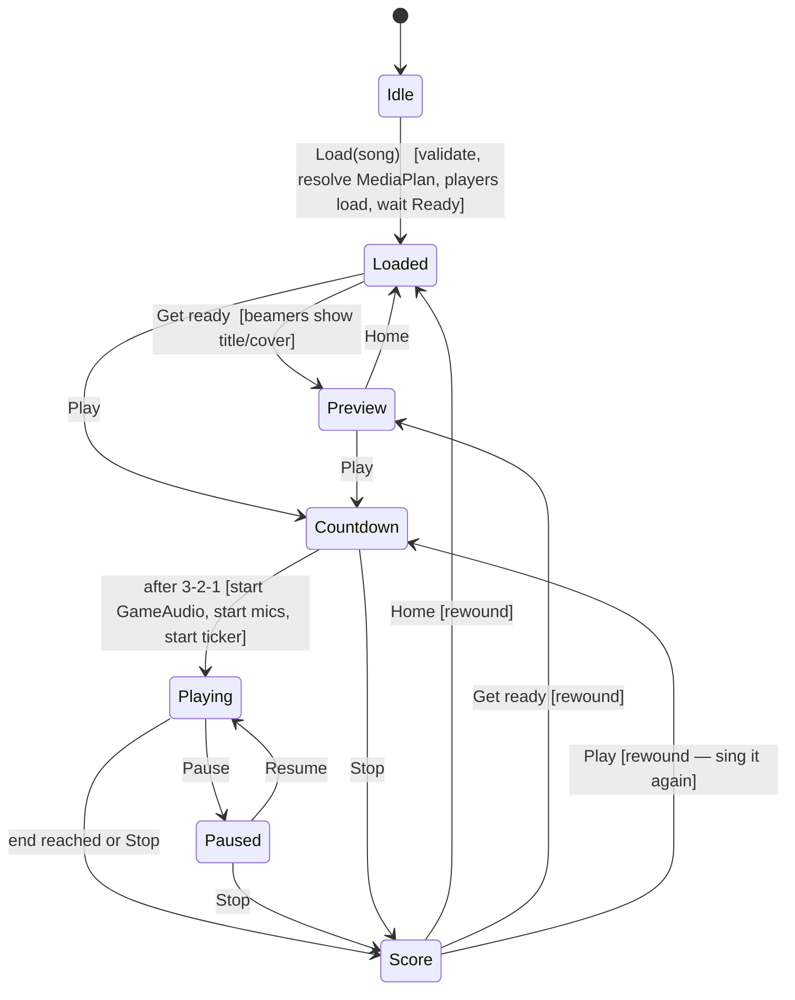

# 03 — Game Engine: timing, microphones, pitch, scoring, rendering data

All of this was implemented and tuned in the prototype. Formulas and thresholds below are the
tested values — keep them unless a test proves otherwise.

---

## UltraStar timing essentials

| Tag | Unit | Meaning |
|---|---|---|
| `#BPM` | quarter-beats/min ×¼ | **Real beats per minute = BPM × 4.** `#BPM:120` → 480 beats/min |
| `#GAP` | **ms** | Audio time of beat 0 |
| `#VIDEOGAP` | **seconds** | See `02-media-engine.md` |
| `#START` / `#END` | seconds / ms (check parser) | Playback range |
| note `pitch` | semitones relative to C4 (=0) | 12 per octave; may be negative |
| note `startBeat`, `lengthBeats` | beats | may be **negative** (pre-GAP notes) — never clamp |

```csharp
static double BeatLengthSec(double bpm) => 60.0 / (bpm * 4);
static double BeatAt(double gameTimeSec, Song s) => (gameTimeSec - s.GapMs / 1000.0) / BeatLengthSec(s.Bpm);
static double MsToBeats(double bpm, double ms) => (ms / 1000.0) * (bpm / 60.0) * 4;
```

Note types: `:` normal, `*` golden, `F` freestyle, `R` rap, `G` rap-golden. `-` ends a phrase (line break),
`P1`/`P2` switch voice (duet → separate `NoteTrack`). `#RELATIVE:yes` is legacy — detect and warn, don't crash.
Syllable spacing: trailing/leading spaces in the note text are word boundaries — the parser **must not trim** them.

---

## Playback state machine


```mermaid
stateDiagram-v2
  [*] --> Idle
  Idle --> Loaded: Load(song)   [validate, resolve MediaPlan, players load, wait Ready]
  Loaded --> Preview: Get ready  [beamers show title/cover]
  Preview --> Loaded: Home
  Loaded --> Countdown: Play
  Preview --> Countdown: Play
  Countdown --> Playing: after 3-2-1 [start GameAudio, start mics, start ticker]
  Playing --> Paused: Pause
  Paused --> Playing: Resume
  Playing --> Score: end reached or Stop
  Paused --> Score: Stop
  Countdown --> Score: Stop
  Score --> Loaded: Home [rewound]
  Score --> Preview: Get ready [rewound]
  Score --> Countdown: Play [rewound — sing it again]
```

Owner: `PlaybackService` (App); which action is allowed when: `Core.Playback.PlaybackRules` (tested).
The Game Player card has four buttons (prototype): **Home** (beamers to the start view, song stays loaded),
**Get ready**, **Play/Pause** (one button: play → pause while playing → resume; shows play and is disabled during
the countdown) and **Stop** (score screen). Home is disabled while a song runs — Stop ends a song, never Home.
A song is only unloaded by loading another one.

Rules from the prototype:
- `Load` allowed only in `Idle`/`Loaded`/`Preview`/`Score`.
- `Play` allowed only when a beamer is open **and** media is `Ready`.
- Audio-config views are locked while `Countdown`/`Playing`/`Paused`.
- A beamer that closes while `Countdown`/`Playing`/`Paused` (by hand, Displays panel, failure) stops the song like Stop
  (score screen) with a warning toast; the DJ reopens it and presses Play.
- The countdown runs **on the beamer clock**: `BeamerWindow` shows 3-2-1 and reports `CountdownDone`; the first report starts the media (dedupe when two beamers report). This is what makes the visual countdown and audio start coincide.

---

## Microphone pipeline (per player)

```
PortAudio input (device, channel L/R/mono)
  → inputGain (0–2)                      ← boosts quiet mics; applied first
  → noise gate (threshold 0–0.5, peak)   ← below → silence: no pitch, no monitor output
  → level meter (RMS, 20 Hz to UI)
  → hop buffer 2048 samples @ device rate (≈46 ms @ 44.1 kHz), hop 256
  → YIN → (frequencyHz, clarity)          ← reject clarity < 0.9 or hz outside 60–1200
  → midi = 69 + 12·log2(hz/440)  (float; UltraStar pitch = midi − 60)
  → PitchRingBuffer(5) median             ← rejects one-frame spikes; cleared on start/resume
  → PitchSample { PlayerId, MidiNote (−1 = silence), Level }
```

- One `MicPipeline` per **active** player = has a mic assigned, not disconnected, assigned to an **open** display.
- Runs entirely on the PortAudio callback thread + one worker; **no allocations** in the callback (preallocated buffers, `ArrayPool` never used there).
- `PortAudio` stream per **device**, demuxed to players by channel — two players on L/R of the same interface share one stream.
- Hot-plug: device list polled every 3 s; disappearance → `MicDisconnected(playerId)` message, pipeline stopped, UI toast; reappearance → `MicReconnected`, auto-restart if still assigned.

### Monitoring mix

`MonitorMixer` opens one PortAudio **output** stream on the game output device (respecting channel offset)
and sums each active player's gated mic × `mixGain` (0–2, muted → 0, fader position kept). Starts when the
song starts, stops on `Score`/`Stop`. Optionally available in mic-test mode.

### Latency and sync

`Core.Timing.LatencyModel` (tested). Two measured quantities, after USDX / Tune Perfect:

- **Output latency** per game output (device + stereo pair, `OutputsService`, 0–800 ms): the app plays a sound →
  the audience hears it (cable ~15 ms, TV/HDMI 50–150 ms, Bluetooth 150–300 ms). The beamers and the scorer use
  `display = clock − latency`, so lyrics and notes appear when the audience hears the song. Set in Audio Output →
  Game → **LATENCY** with **Test sync**: a click every second on the game output (`Audio.Monitor.SyncClicks`,
  sample-exact) and a disc on every open beamer at first click + k s + latency (`SyncTestService`,
  `Controls.SyncFlash`, per display frame). Flash and click together ⇔ the value is right; the flash goes through
  the same render path and projector as the lyrics. Needs an open beamer and no running song. Replaces the old
  Settings → Lyrics offset (migrated once: latency = −offset).
- **Calibrated total** per player (Audio Input → **Calibrate**, `LatencyTest`): an A4 tone on the game output →
  speaker → air → mic → USB → the game's own pitch analysis (`MicPipeline`, every 33 ms) → A4 recognised. 5 trials,
  median. Stored with the output it was measured on. The player's **mic delay** = total − that output's latency
  (never below 0); uncalibrated players use 140 ms (USDX's default).

Scoring compares at `display − mic delay` (`GameSession.SungBeatAt`, USDX `MidBeatD`): it is not applied as an audio
delay, it shifts the beat a heard pitch is matched against. The sung fill therefore lags the lyrics by the mic delay
— correct and expected. Because the mic delay subtracts the latency of the calibration output, scoring does not
change if the latency is set before or after calibrating (test `Scoring_IsIndependentOfWhenTheLatencyWasSet`);
the order "Test sync, then Calibrate" only makes the shown mic delay meaningful.

The pitch analysis alone takes ≈ 60 ms from a tone onset to a stable note (YIN window 2048 at 48 kHz, analysis
every 33 ms, median of 5; measured by `PitchPathDelayTests`). The old calibration detected the beep in the raw
signal and missed it; the tone-through-analysis calibration includes it.

---

## Smooth note fill and clock

- **Clock** (`Media.MediaGameClock`, tested): after USDX `TLyricsState.Synchronize` — an own high-resolution timer
  drives song time; mpv's `time-pos` only corrects it (averaged difference; timer behind > 10 ms → jump forward,
  ahead > 10 ms → hold until the audio catches up; > 250 ms off = seek → follow at once; paused = audio position).
  Never runs backwards.
- **Sung beat** (`GameSession.SungBeatAt`, tested): song beat − the player's mic delay (USDX `MidBeatD`, per player).
  The scorer evaluates it; the beamer's fill grows up to it.
- **Fill edge**: the beat being sung right now ends at the continuous sung beat instead of its whole-beat end
  (USDX `SingDrawPlayerLine`: right − (1 − frac(MidBeatD))). Tune Perfect does the same with its delayed beat.
- **Redraw**: `GameOverlayControl` redraws once per display refresh (`TopLevel.RequestAnimationFrame`).
- Not adopted: USDX's mid-beat sampling (−0.5 beat). USDX samples each beat once; we sample it at 60 Hz and keep
  the best result, so shifting would only add delay.
- Latency: everything above reads `display = clock − output latency`; see "Latency and sync".

## Note bars (beamer)

Prototype NoteLane.svelte, drawn in `GameOverlayControl`: ≤ 2 players on a beamer → 16 rows, bars ≥ 40 px, radius 8;
3–4 players → 12 rows, ≥ 28 px, radius 4 (bar = max(80 % row, minimum)). Settings → **Note bar style**: White
(white 18 % fill, white 35 % border) or Black (black 45 %, white 55 %); border mixed 55 % with the player colour,
2 px, soft glow. Golden: gold tint + border, glow, shimmer (1.4 s). Rap: dashed orange, never filled; hit (any voice) → solid with an orange
glow settling over 0.5 s, badge R (★ golden rap). Freestyle: thin white dots (1 px); once the player is heard on it, a solid border in their colour with a glow,
badge F, never filled. ≥ 50 % correct → border pulse (white; gold for golden) peaking at 40 % of 0.5 s, then a lasting glow.
Correct fill = player colour 85 % inside the bar (golden: gold); wrong = player colour 50 % on the sung row.
Scoring effects (`App.Game.ScoreEffects`, after USDX UGraphicClasses / USingScores, allocation-free): a perfect
note (every beat right) gets three twinkling stars at its top-right corner once sung through; golden notes sparkle on
the sung part with a twinkle at the fill edge while hit; at the end of each phrase (when the mic has delivered its
last beat) `Core.Game.PhraseRating` rates it — round(share of the phrase's points × 8) — and GREAT! (6), AWESOME! (7)
or PERFECT! (8, ≈ 94 %+) pops up in the lane (0.35 s pop, 0.55 s rise to 70 %, 0.2 s fade); USDX's lower words
(awful … good) are not shown. A 100 % phrase also bursts stars in the player's colour. On the score screen, once the count-up has finished, stars in the
winner's colour twinkle and drift upwards for 5 s (`Controls.StarShower`).

## Elapsed / remaining (beamer)

`Core.Timing.SongTimeline` (tested) is the playing span in game time (0 = audio start; `#VIDEOGAP` already taken
out when the video is the audio): **start** = `#START`; **end** = earliest of `#END`, last note + 4 s tail (where the
app stops by itself) and the media length minus `#VIDEOGAP` (video-is-audio cases). `#GAP` moves the last note.
Elapsed = clock − start, remaining = end − clock, progress = elapsed / (end − start), all clamped. Built once in
`PlaybackService.StartSong` (media length known); the auto-stop uses the same end. The beamer shows it in the bottom strip:
the progress bar flush with the bottom edge (first player's colour, lead-in blue without players), elapsed /
remaining pills just above it at the sides, and the lyrics anchored to the bar (the next phrase ends just above it).
The strip is as high as its content; font sizes follow the screen height. Uses the display time (clock − output latency), like the lyrics.

## Mic plug / unplug

Rule: **a player only has a mic while it is plugged in.** Device ids are device names; `AudioInputService` tracks
presence, the rules are in `Core.Players.MicPresence` (tested).

- **Detection:** PortAudio can only re-enumerate with no stream open. Idle (no mic test, no song, no monitor): the
  device list is re-read every 3 s. With streams open, a dying stream reports its device (`MicEngine.DeviceLost`).
  Opening a stream and re-enumerating share one lock in `PortAudioBackend`.
- **Unplugged** (idle, during a mic test, or at start for a saved mic that is not there): the mic is **unassigned**
  (dropdown shows "— no microphone —"), a toast names the players. `DisplayService` takes a player without a mic off
  its beamer; that card's mic test stops. Nothing is restored automatically.
- **Plugged in:** toast "Microphone connected — assign it under Audio Input"; the device lists update by themselves.
- **Mid-song loss** (`GameMicLost`): the song **stops** (rewound, still loaded), **both beamers close**, a warning
  toast in the DJ window explains: plug in, assign, start again.
- **Mic test is per player card** (Test / Stop); tested mics are one set opened together (L/R of one dongle share a
  stream); the monitor follows the tested mics. Closing the Audio Input panel (any way) stops all tests.

## Scoring (`Core.ScoreEngine`)

Runs on the 60 Hz `GameTick` (throttle beat evaluation to **once per beat**, not per tick — at 480 beats/min
a beat is 125 ms; ticks between beats re-use the last result).

**Octave-invariant match**

```csharp
static bool Matches(double sungMidi, int targetUsPitch, double tolerance)
{
    double sungUs = sungMidi - 60;                       // UltraStar pitch space
    double diff = Math.Abs(sungUs - targetUsPitch) % 12;
    double distance = diff > 6 ? 12 - diff : diff;       // fold to [0, 6]
    return distance <= tolerance;
}
```

| Difficulty | tolerance (semitones) |
|---|---|
| Easy | 2 |
| Medium | 1 |
| Hard | 0.5 |

**Per beat**

| Note type | Correct when | Points |
|---|---|---|
| normal | match | 1 × pointsPerBeat |
| golden | match | 2 × pointsPerBeat |
| rap / rap-golden | any sound above gate | 1× / 2× |
| freestyle | always "correct", no points | 0 |

`pointsPerBeat = 10_000 / totalScorableBeats` (golden counted ×2 in the denominator so the max is exactly 10 000).
Phrase bonus (all beats of a phrase correct): +1 000 → clamp final to 10 000. *(Confirm against USDX if we
want parity; the prototype used a simpler variant.)*

**Per-note state** (used by the beamer): `correctBeats`, `isFullyCorrect = correctBeats * 2 >= lengthBeats`
(50 % threshold — accounts for beat skipping at high BPM), `firstSungRow` for the wrong-fill row.

**Output**: `ScoreEngine` publishes `PitchTick` messages ~20 Hz:

```csharp
record PitchTick(int PlayerId, double Beat, double MidiNote, bool Correct, bool IsFirstInNote,
                 NoteType NoteType, int RowPitch, int Score, int MaxScore);
```

Beamers keep their own incremental note-fill state from these ticks (no history replay).

---

## Beamer rendering data model

Each `BeamerWindow` shows, for **its assigned players only**, one `NoteLane` each (stacked), plus one shared
lyrics bar and a progress bar. Everything is driven by `GameTick` + `PitchTick` — the beamer never asks the
engine for state.

### Active phrase

```
activeLine = the LyricLine whose [firstNote.startBeat, lastNote.end] contains currentBeat,
             else the next upcoming line.            (use firstNote.startBeat, not line.startBeat)
activeLine is extended by min(micDelayBeats, gapToNextPhrase/2) so late mic data still lands in it.
```

### Note lane geometry (per phrase, recomputed only on phrase change)

```
rowCount     = players on this beamer ≤ 2 ? 16 : 12
phraseStart  = notes[0].startBeat ; phraseBeats = lastNote.end − phraseStart
x (0..1)     = (note.startBeat − phraseStart) / phraseBeats
w (0..1)     = note.lengthBeats / phraseBeats
row          = PitchToRow(note.pitch, avgPhrasePitch, rowCount)   // octave-wrapped
y (0..1)     = (row − 1) / rowCount ; h = 1 / rowCount
```

```csharp
static int PitchToRow(int pitch, double avg, int rowCount)
{
    int p = pitch;
    int min = (int)Math.Floor(avg - rowCount / 2.0);
    int max = min + rowCount - 1;
    while (p > max) p -= 12;
    while (p < min) p += 12;
    double offset = p - avg;
    return Math.Abs((int)Math.Ceiling(rowCount / 2.0 + offset) - rowCount) - 1;
}
```

Styles: normal = white/black bar (setting), golden = gold with pulsing glow, rap = dashed border,
freestyle = dotted border; syllable text centred inside when `lengthBeats ≥ 2`. Bars have min height
(readability floor) and rounded corners (8 px for ≤ 2 players, 4 px for 3–4).

### Sung fill

- Per note: fill grows **beat by beat** from the note's left edge as `PitchTick`s arrive (bridge gaps ≤ 2
  beats caused by tick skipping).
- Correct → drawn **inside the note bar** in player colour.
- Wrong → drawn at the **sung row** (fixed at the first wrong beat of the segment — no vibrato jitter), dimmed.
- Fully-correct note → glow; all notes of the phrase correct → "PERFECT" flash (also checked at phrase switch).

### Playhead

Vertical line at `x = (positionSec − phraseStartSec) / phraseDurSec` — recomputed every tick from the clock,
not animated independently. (The prototype used a CSS animation to escape JS jank; with Skia + our own
60 Hz tick a direct draw is simpler and correct.)

### Lyrics bar

Current phrase large, next phrase smaller/dimmed; per-syllable **sweep** = horizontal gradient at
`(currentBeat − note.startBeat) / note.lengthBeats`; 3-second **lead-in bar** shrinking right→left before a
phrase starts after a gap; `white-space: pre` semantics (syllable spaces preserved).

### Screens

`Idle` (logo), `Preview` (cover, artist, title, assigned player badges), `Countdown` (3-2-1 over the
background), `Playing`/`Paused`, `Score` (all players, sorted by id, animated count-up 1.8 s ease-out,
winner highlighted).

---

## Rendering implementation guidance (see `04-ui.md`)

- One custom `GameOverlayControl : Control` per beamer draws lanes, fills, playhead, lyrics with
  `DrawingContext` on each `GameTick` (`InvalidateVisual` from the UI thread). Static geometry per phrase is
  cached; per-tick work is only the fill and playhead. No per-tick allocations of brushes/pens — cache them.
- The video `VideoSurface` sits underneath; the overlay is transparent.
- Target: 60 fps on a 1080p beamer with 2 lanes on a 2020-class laptop.

---

## Test cases to port (Core.Tests / Audio.Tests)

- Parser: `,` decimals; `#MP3` vs `#AUDIO`; `#VIDEO` URL → youtubeId; negative beats; pre-GAP notes; duet `P1/P2`; `#RELATIVE` warning; syllable spacing preserved.
- BeatMath: quadrupled BPM; `MsToBeats(120, 125) == 1`.
- Matching: octave folding (sung 72 vs target 0 → match), tolerance per difficulty, rap = any sound.
- Score: max exactly 10 000 for a perfect run incl. golden; freestyle contributes 0.
- PitchToRow: wrap cases from the prototype.
- RingBuffer: median rejects single spike; cleared on start.
- Determinism: identical `PitchSample` sequence → identical score (see `05-conventions.md`, non-determinism lesson).
